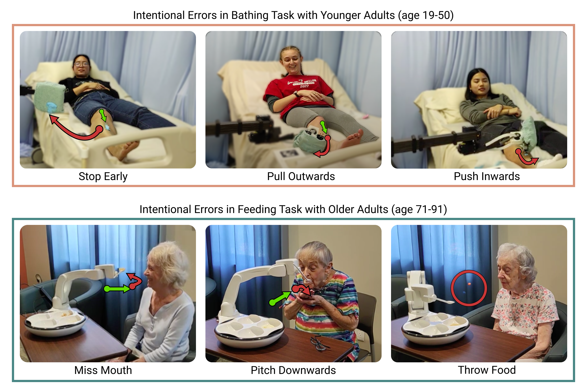
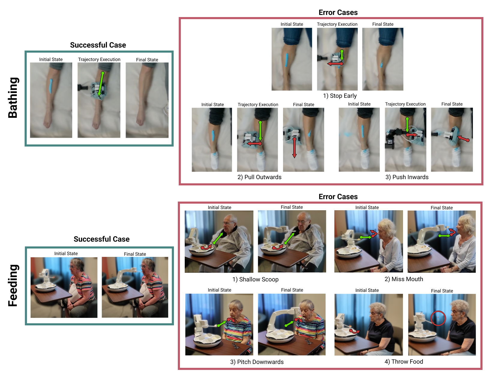

<!---
# Do Mistakes Matter? Comparing Trust Responses of Different Age Groups to Errors Made by Physically Assistive Robots
---->
## Do Mistakes Matter? Comparing Trust Responses of Different Age Groups to Errors Made by Physically Assistive Robots
### Sasha Wald\*, Kavya Puthuveetil\*, Zackory Erickson
Robotics Institute, Carnegie Mellon University
## [[arXiv]](https://google.com)  &nbsp;  [[Video]](https://google.com)  &nbsp; 

<h2 style="text-align: center;">Abstract</h2>

Trust is a key factor in ensuring acceptable
human-robot interaction, especially in settings where robots
may be assisting with critical activities of daily living. When
practically deployed, robots are bound to make occasional
mistakes, yet the degree to which these errors will impact a care
recipient’s trust in the robot, especially in performing physically
assistive tasks, remains an open question. To investigate this,
we conducted experiments where participants interacted with
physically assistive robots which would occasionally make inten-
tional mistakes while performing two different tasks: bathing
and feeding. Our study considered the error response of two
populations: younger adults at a university (median age 26) and
older adults at an independent living facility (median age 83).
We observed that the impact of errors on a users’ trust in the
robot depends on both their age and the task that the robot is
performing. We also found that older adults tend to evaluate
the robot on factors unrelated to the robot’s performance,
making their trust in the system more resilient to errors when
compared to younger adults.

<h3 style="text-align: center;">Error Examples</h3>

